<div align="center">

# 📦 Shipping Container Damage Detection with YOLO11

### An End-to-End Object Detection Pipeline — EDA → Training → Evaluation → Model Comparison


[](https://www.python.org/)
[](https://github.com/ultralytics/ultralytics)
[](https://pytorch.org/)
[](LICENSE)

[](https://jupyter.org/)
[](https://www.kaggle.com)
[](https://roboflow.com)

</div>

---

## 🧭 Overview.

Shipping containers take a beating in transit — repeated handling, weather exposure, and stacking stress leave them **dented, punctured, and structurally deformed**. Manual inspection is slow, subjective, and doesn't scale.

This project trains and benchmarks **three YOLO11 variants** (`n`, `s`, `m`) to automatically **detect and localize** three damage types in container images:

| Class | Description |
|---|---|
| 🔴 **Dent** | Localized inward deformation of the container wall |
| 🔵 **Hole** | Puncture / breach in the container shell |
| 🟢 **Deframe** | Structural deformation of the container frame |

Given an image, the model answers two questions simultaneously — **what** damage is present, and **where** it is — via bounding boxes and confidence scores.

---

## 🏆 Headline Result.

> **YOLO11s wins on accuracy** (`mAP50-95 = 0.845`) while staying **~2× smaller and faster** than YOLO11m — the best accuracy-per-parameter trade-off of the three.

| Model | Precision | Recall | mAP@50 | mAP@50-95 | Params (M) | Weights (MB) | Inference (ms/img) |
|---|:---:|:---:|:---:|:---:|:---:|:---:|:---:|
| 🥇 **YOLO11s** | **0.972** | 0.940 | **0.958** | **0.845** | 9.43 | 18.30 | 10.97 |
| 🥈 YOLO11n | 0.932 | **0.940** | 0.956 | 0.824 | **2.59** | **5.22** | **7.35** |
| 🥉 YOLO11m | **0.972** | 0.902 | 0.952 | 0.788 | 20.06 | 38.65 | 31.55 |

*Sorted by mAP@50-95 on the held-out test set. Full breakdown in [Results](#-results--evaluation).*

---

## 📑 Table of Contents

- [Overview](#-overview)
- [Headline Result](#-headline-result)
- [Pipeline Architecture](#-pipeline-architecture)
- [Dataset](#-dataset)
- [Exploratory Data Analysis](#-exploratory-data-analysis)
- [Model Training](#-model-training)
- [Results & Evaluation](#-results--evaluation)
- [Repository Structure](#-repository-structure)
- [Getting Started](#-getting-started)
- [Notebook Phases](#-notebook-phases)
- [Roadmap](#-roadmap)
- [Citation](#-citation)
- [License](#-license)

---

## 🗺️ Pipeline Architecture

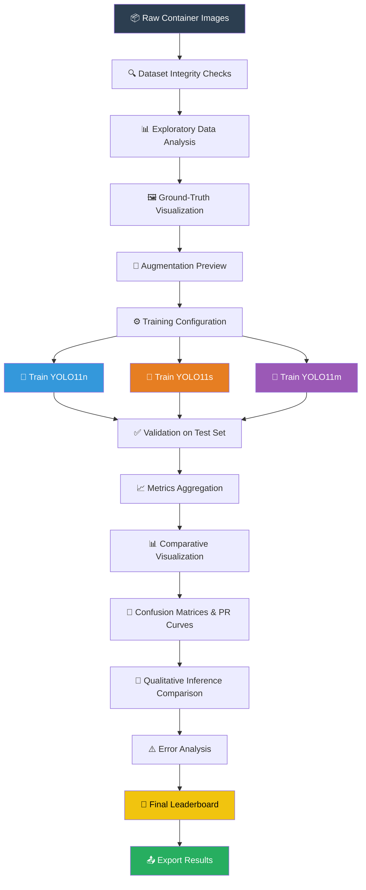

### Model Inference Flow

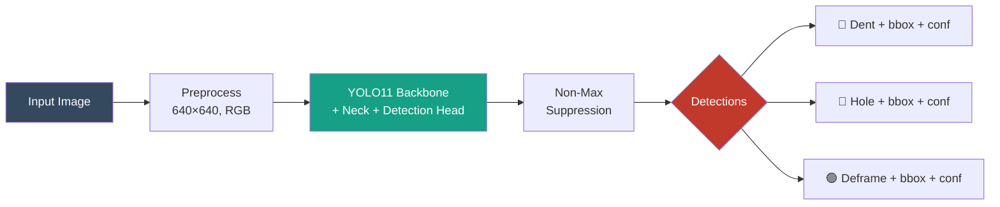


---

## 🗂️ Dataset

- **Source:** [Roboflow](https://roboflow.com) → mirrored on [Kaggle](https://www.kaggle.com) as `siirrii/damaged-shipping-containers`
- **License:** CC BY 4.0
- **Format:** YOLO object-detection format (`images/` + `labels/` per split)

```
Container damaged parts detection dataset/
├── data.yaml
├── train/
│   ├── images/   (544 images)
│   └── labels/   (544 files)
├── valid/
│   ├── images/   (68 images)
│   └── labels/   (68 files)
└── test/
    ├── images/   (68 images)
    └── labels/   (68 files)
```

| Metric | Value |
|---|---|
| Total images | **680** |
| Total annotations | **1,040** bounding boxes |
| Split ratio | 80% train / 10% valid / 10% test |
| Image format | 100% JPEG, RGB (3-channel) |
| Resolutions | 640×640 (612 imgs), 1024×1024 (68 imgs) — all square (AR = 1.0) |
| Integrity | ✅ 0 missing labels · 0 orphan labels · 0 invalid annotations · 0 empty files |
| Instances / image | mean **1.53**, median 1, max 5 |

### Class Balance

| Damage Type | Annotations | Share |
|---|---:|---:|
| 🔴 Dent | 630 | 60.6% |
| 🔵 Hole | 250 | 24.0% |
| 🟢 Deframe | 160 | 15.4% |

> ⚠️ **Class imbalance noted** — `Deframe` is the minority class (15.4%). This drives the per-class evaluation strategy throughout the notebook rather than relying on aggregate mAP alone.

---

## 🔬 Exploratory Data Analysis

<table>
<tr>
<td width="50%">

**Dataset statistics (format / resolution / aspect ratio)**
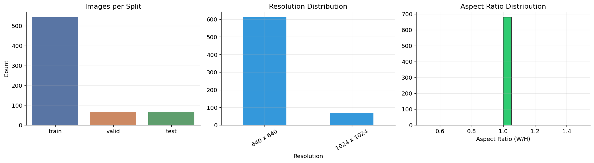

</td>
<td width="50%">

**Class distribution (counts + proportion)**
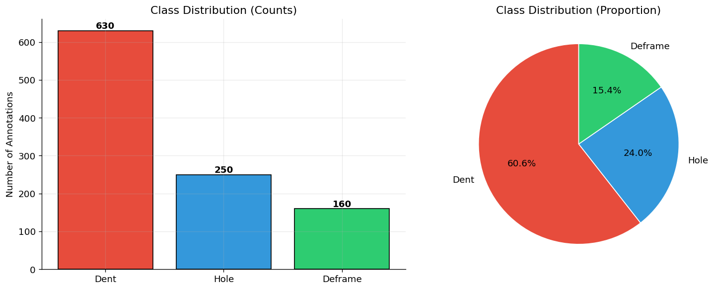

</td>
</tr>
<tr>
<td width="50%">

**Class distribution across splits**
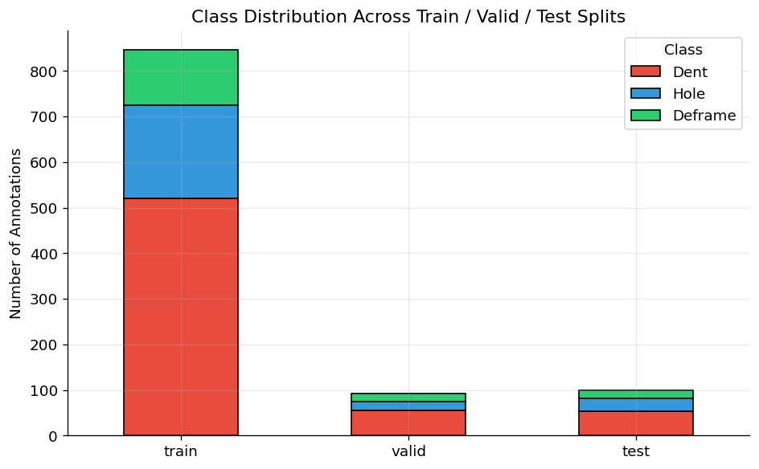

</td>
<td width="50%">

**Bounding-box geometry (width / height / area)**
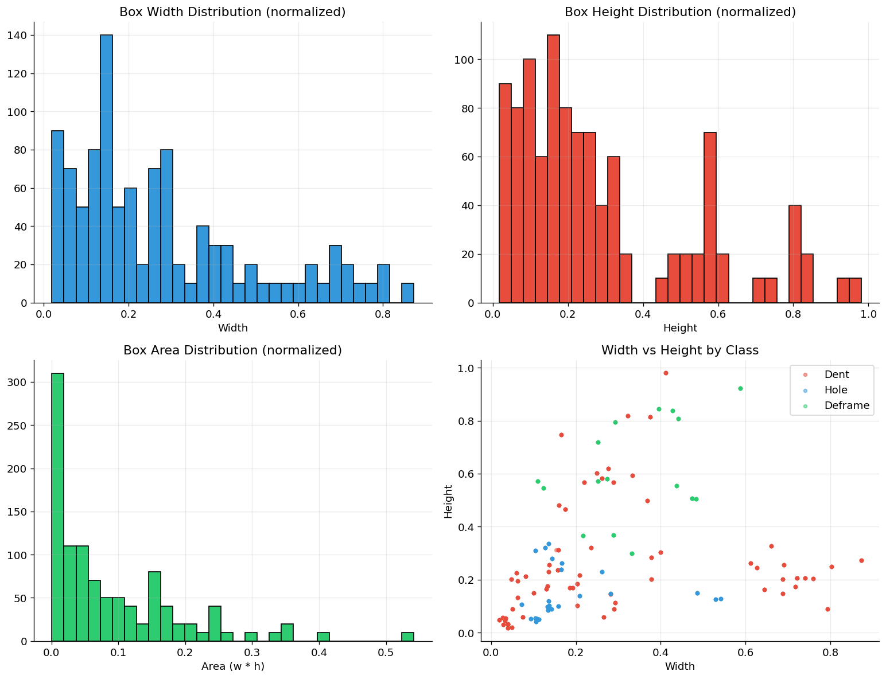

</td>
</tr>
<tr>
<td width="50%">

**Object size category (small / medium / large)**
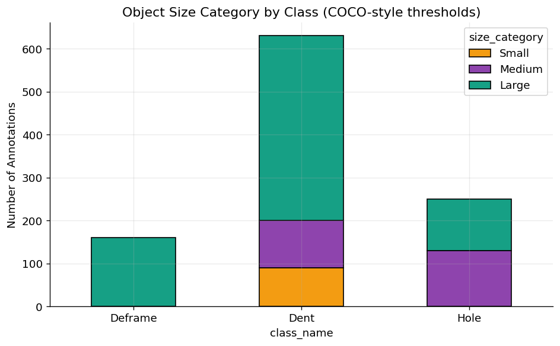

</td>
<td width="50%">

**Spatial density heatmap per class**
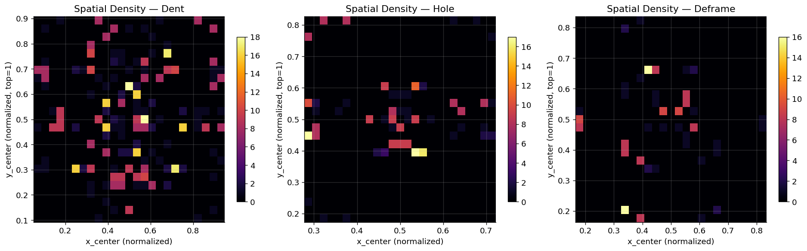

</td>
</tr>
<tr>
<td width="50%">

**Instances per image**
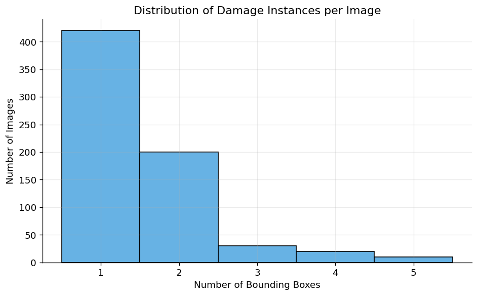

</td>
<td width="50%">

**Ground-truth samples with bounding boxes**
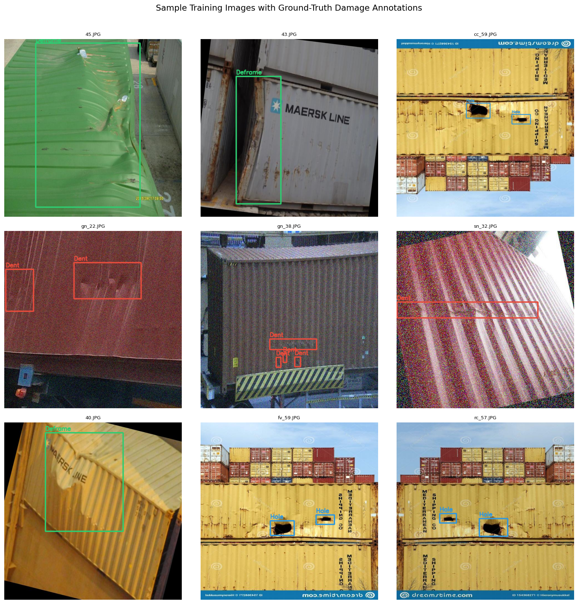

</td>
</tr>
</table>

**Augmentation preview** (illustrative — flip / HSV jitter / rotation / blur):

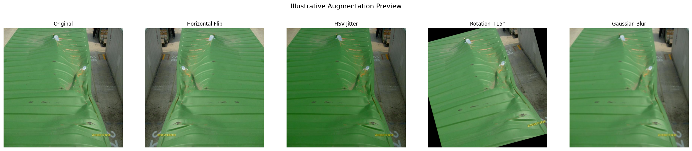

---

## 🧠 Model Training

Three YOLO11 variants were trained **under an identical protocol** — same data split, image size, epoch budget, and random seed — to cleanly isolate the effect of model capacity.

```mermaid
gantt
    title Training Configuration Timeline
    dateFormat X
    axisFormat %s
    section YOLO11n
    Nano backbone, 2.59M params      :a1, 0, 100
    section YOLO11s
    Small backbone, 9.43M params     :a2, 0, 100
    section YOLO11m
    Medium backbone, 20.06M params   :a3, 0, 100
```

| Config | Value |
|---|---|
| Image size | 640 × 640 |
| Batch size | 16 |
| Epochs | 100 (early-stop patience 30) |
| Optimizer | auto |
| Seed | 42 |

**Training curves** (validation box loss & mAP50-95 over epochs, all 3 models overlaid):

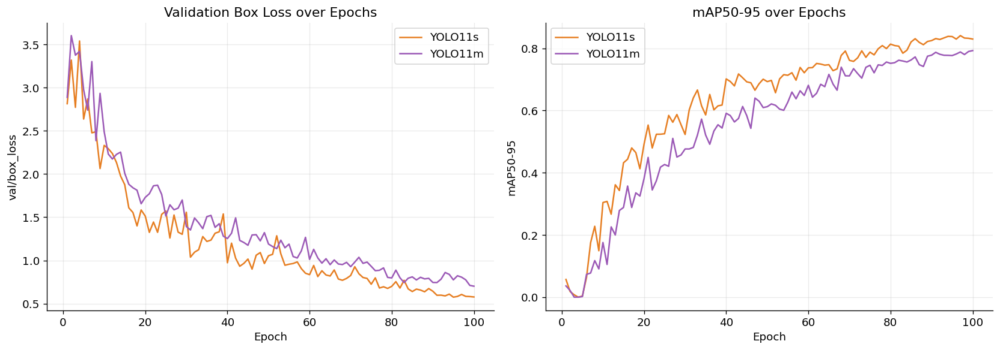

---

## 📈 Results & Evaluation

### Overall Metrics

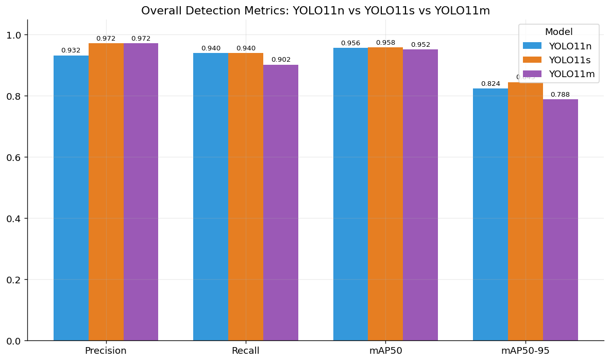

### Per-Class AP@50

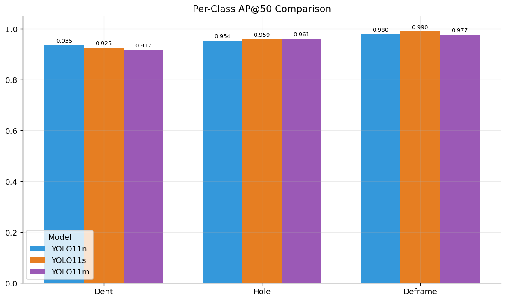

| Model | AP50 Dent | AP50 Hole | AP50 Deframe | AP50-95 Dent | AP50-95 Hole | AP50-95 Deframe |
|---|:---:|:---:|:---:|:---:|:---:|:---:|
| YOLO11n | 0.935 | 0.954 | 0.980 | 0.763 | 0.813 | 0.896 |
| YOLO11s | 0.925 | 0.959 | **0.990** | 0.767 | 0.821 | **0.947** |
| YOLO11m | 0.917 | 0.961 | 0.977 | 0.734 | 0.780 | 0.850 |

### Accuracy vs. Efficiency Frontier

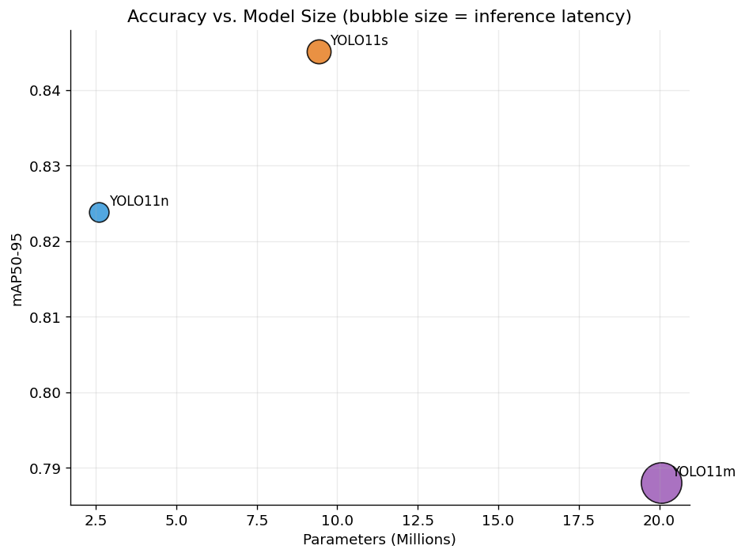

> YOLO11s sits at the sweet spot — near-YOLO11m accuracy at less than half the parameter count and 3× faster inference than YOLO11m.

### Confusion Matrices (Test Set)

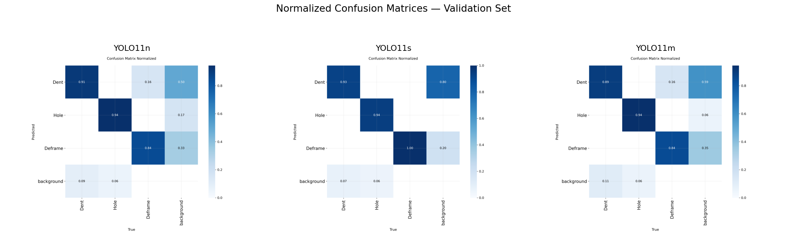

### Precision–Recall Curves (Test Set)

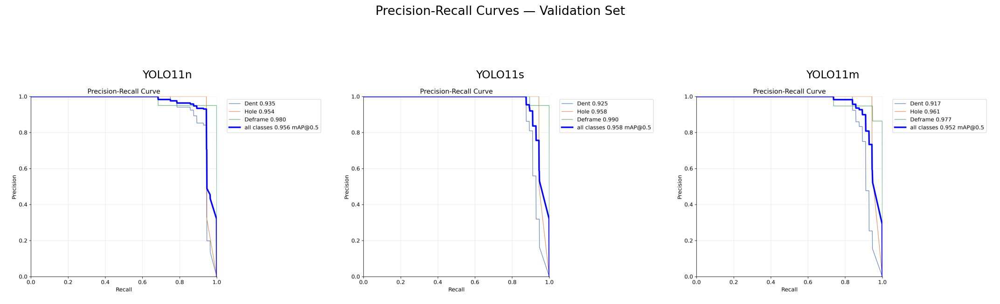

### Qualitative Inference — Side-by-Side

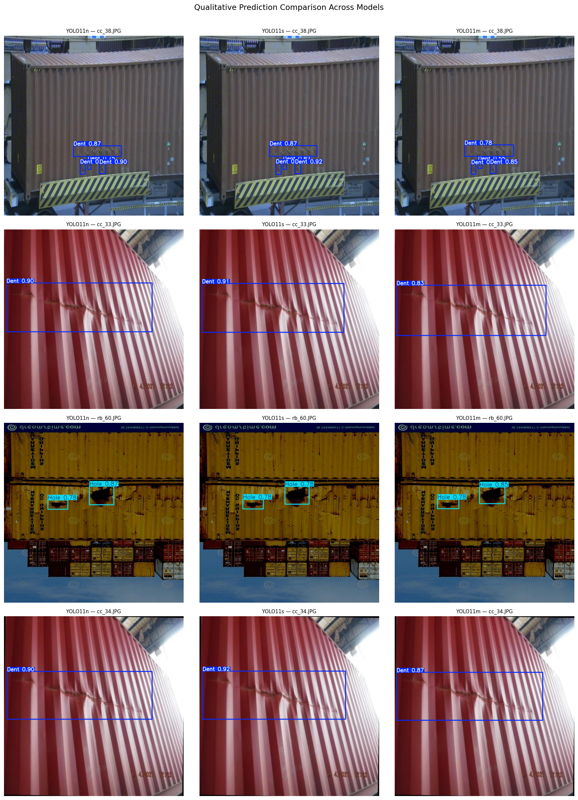

### Error Analysis

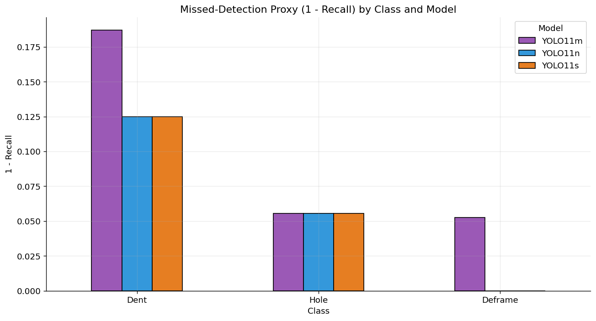

| Model | Class | Precision | Recall | Missed-Detection (1-Recall) | False-Positive (1-Precision) |
|---|---|:---:|:---:|:---:|:---:|
| YOLO11n | Dent | 0.901 | 0.875 | 0.125 | 0.099 |
| YOLO11n | Hole | 0.948 | 0.944 | 0.056 | 0.052 |
| YOLO11n | Deframe | 0.949 | **1.000** | **0.000** | 0.051 |
| YOLO11s | Dent | 0.991 | 0.875 | 0.125 | 0.009 |
| YOLO11s | Hole | 0.985 | 0.944 | 0.056 | 0.016 |
| YOLO11s | Deframe | 0.941 | **1.000** | **0.000** | 0.059 |
| YOLO11m | Dent | **1.000** | 0.813 | 0.187 | **0.000** |
| YOLO11m | Hole | 0.991 | 0.944 | 0.056 | 0.009 |
| YOLO11m | Deframe | 0.925 | 0.947 | 0.053 | 0.075 |

**Key finding:** `Dent` recall is the weakest link across *all three* models (81–88%), despite being the majority class — likely due to its highly variable box size (1.9%–87% of image width). `Deframe`, despite being the minority class, achieves perfect recall in the smaller models, suggesting its visual signature is more distinctive than expected.

---

## 📁 Repository Structure

```
container-damage-yolo/
├── README.md
├── damaged.ipynb                  # Full end-to-end notebook (this pipeline)
├── assets/                        # Exported charts used in this README
│   ├── phase05_dataset_stats.png
│   ├── phase06_class_distribution.png
│   ├── phase07_bbox_geometry.png
│   ├── phase09_sample_gt_boxes.png
│   ├── phase17_overall_metrics_comparison.png
│   ├── phase18_confusion_matrices.png
│   └── ...
├── runs/
│   ├── train/
│   │   ├── yolo11n_container_damage/weights/best.pt
│   │   ├── yolo11s_container_damage/weights/best.pt
│   │   └── yolo11m_container_damage/weights/best.pt
│   └── val/
├── results_export/
│   ├── full_metrics_comparison.csv
│   ├── per_class_error_analysis.csv
│   ├── dataset_integrity_report.csv
│   └── class_distribution_summary.csv
├── data.yaml
└── requirements.txt
```

---

## 🚀 Getting Started

### 1. Clone & install

```bash
git clone https://github.com/SiriNandinii/container-damage-yolo.git
cd container-damage-yolo
pip install -r requirements.txt
```

`requirements.txt`:
```
ultralytics==8.3.*
opencv-python-headless
pandas
numpy
matplotlib
seaborn
pillow
pyyaml
scikit-learn
tqdm
plotly
kaleido
albumentations
```

### 2. Get the dataset

```bash
# via Kaggle CLI
kaggle datasets download -d siirrii/damaged-shipping-containers -p ./data --unzip
```

### 3. Run the notebook

```bash
jupyter notebook damaged.ipynb
```

Update `DATASET_ROOT` in the dataset-configuration cell to point at your local copy, then run all cells top-to-bottom.

### 4. Run inference with a trained model

```python
from ultralytics import YOLO

model = YOLO("runs/train/yolo11s_container_damage/weights/best.pt")
results = model.predict("path/to/container.jpg", conf=0.25)
results[0].show()
```

---

## 📓 Notebook Phases

<details>
<summary><b>Click to expand the full 24-phase breakdown</b></summary>

| # | Phase |
|---|---|
| 1 | Environment setup — install libraries |
| 2 | Import libraries & global config |
| 3 | Dataset configuration & `data.yaml` |
| 4 | Dataset integrity checks |
| 5 | Basic dataset statistics (format, channels, resolution) |
| 6 | Class distribution analysis |
| 7 | Bounding-box geometry analysis |
| 8 | Instances-per-image analysis |
| 9 | Sample visualization with ground-truth boxes |
| 10 | Augmentation preview |
| 11 | Training configuration |
| 12 | Train YOLO11n |
| 13 | Train YOLO11s |
| 14 | Train YOLO11m |
| 15 | Validation of all 3 models |
| 16 | Metrics aggregation |
| 17 | Comparative visualization (bar / radar / efficiency-frontier) |
| 18 | Confusion matrices |
| 19 | PR curves |
| 20 | Qualitative inference comparison |
| 21 | Error analysis |
| 22 | Final leaderboard & model selection |
| 23 | Export results |
| 24 | Conclusion |

</details>

---

## 🛣️ Roadmap

- [ ] Address `Dent` recall gap with size-aware augmentation or anchor tuning
- [ ] Expand `Deframe` examples via targeted data collection
- [ ] Export best model (`YOLO11s`) to ONNX / TensorRT for edge deployment
- [ ] Build a lightweight inference API (FastAPI) around `best.pt`
- [ ] Add active-learning loop for hard-negative mining on false positives

---


## 📄 License

This project is licensed under the [MIT License](LICENSE).

---

<div align="center">

**⭐ If this project helped you, consider starring the repo! ⭐**

Made with 🧡 by [SiriNandinii](https://github.com/SiriNandinii)

</div>
